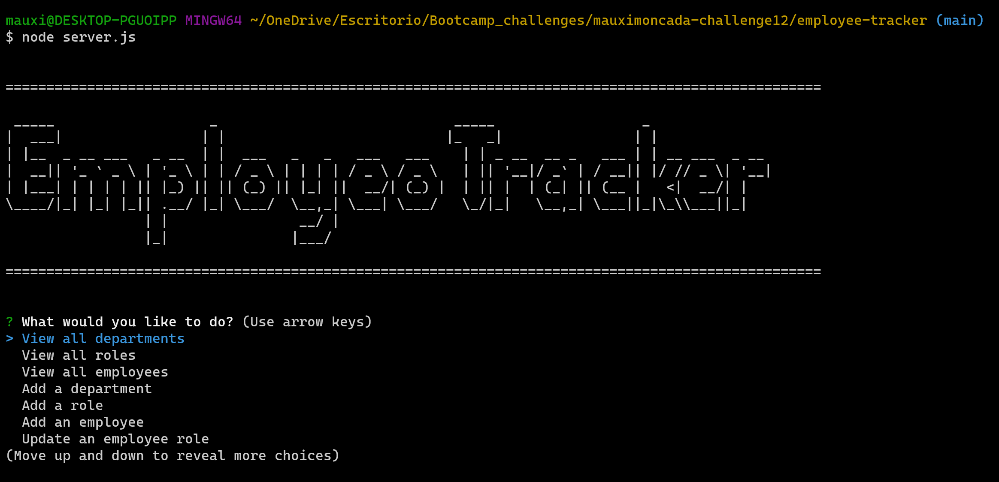

# Employee Tracker

## Description
The following application will help the user/ manager to build a database and keep track of the number of employees, roles and their interactions with the different departments in the company.

The user/ manager will be able to update their roles as required.

-------------------

## Instructions

1. npm install
2. node server.js
3. Navigate through the prompt menu as you wish.

------

## Application Documentation

[Click here to watch this application in action!]()

Github Repo: https://github.com/MoMoncada/employee-tracker

---------------------

## Application Screenshots
---------------------

### Team Profile Page Template

### Manager's prompts

## Credits
Maria Auxiliadora Moncada 

------------

## License
N/A